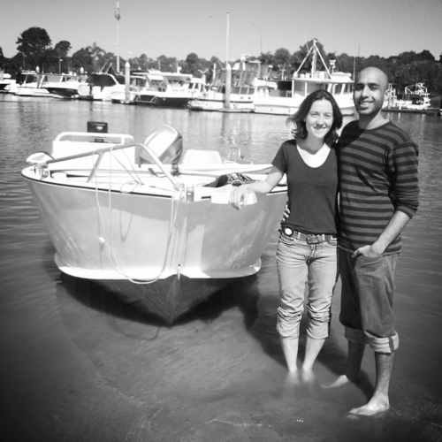
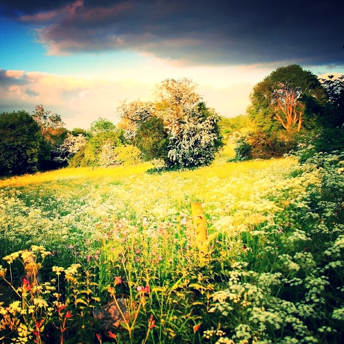
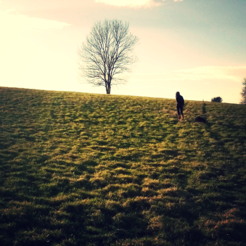

  

    
    <h2>About Us</h2>
    
Gibran Hemani and Josephine Walker met in Edinburgh in February 2011. Almost immediately, Josephine decided to move to the West coast of America and Gibran decided to move to Australia. Anyway some other stuff happened and now they're getting married. For more exciting stories about them and all the other characters in this play, click <a href="/stories/">here</a>.

  

  

    
    <h2>Location</h2>
    
The wedding will take place at <a href="http://www.damgate.com">Lower Damgate Farm</a> in Ilam in the Peak District. It is at least 1.5 hours' drive from Manchester, but allow longer as parts of the journey are along rather narrow and windy single track roads, full of trickery and sheep. Directions can be found <a href="http://www.damgate.com/directions.php">here</a>, and for more information, including where you can find accommodation, click <a href="/location/">here</a>.

  

  

    
    <h2>Schedule</h2>
    
The wedding will take place on Saturday 18th October <a href="http://www.gibandjo.com/location.html">here</a>. The wedding ceremony will start at 1pm sharp, so please make every effort to be there on time. Nobody likes latecomers. Also, nobody likes hecklers so don't heckle. After the ceremony there will be food, music, and dancing. More details <a href="/schedule/">here</a>.

  

  <a href="/img/infosheet.pdf" class="btn-infosheet">Download info sheet</a>

